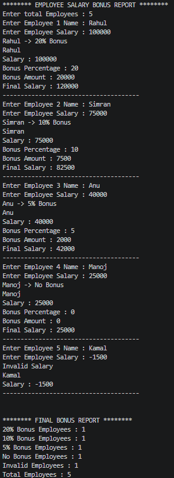

# Employee---Salary---Bonus---System
A beginner-friendly Python project that calculates employee bonuses based on their salary. The program takes employee details as input, determines the bonus percentage using conditional statements, calculates the bonus amount and final salary, handles invalid salary inputs, and generates a summary report.

# Features
- Calculates bonus percentage
- Calculates bonus amount
- Displays final salary
- Handles invalid salary
- Generates summary report

## Project Output

